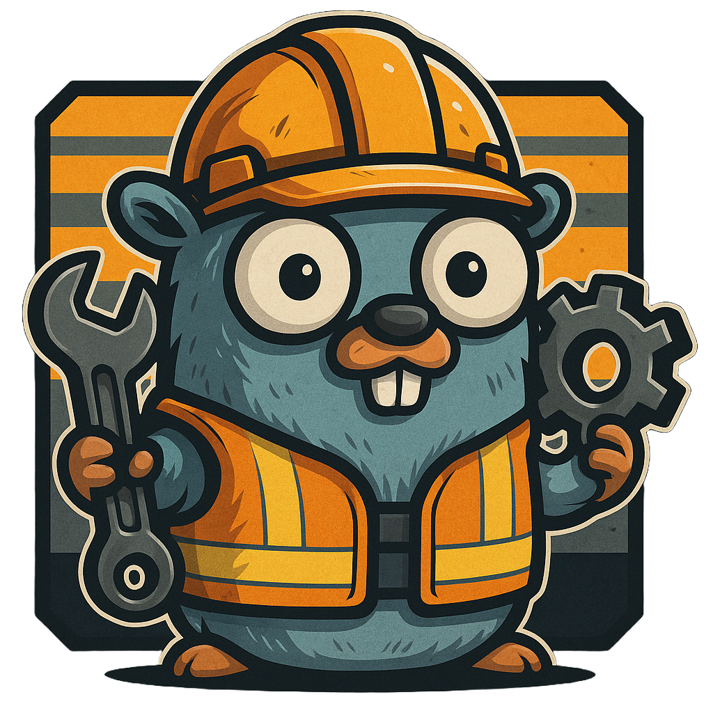

# GoFactory

GoFactory is a (planned) cross-platform CLI tool to interact with your Satisfactory dedicated server, locally or remotely via API.

The project will be modularised into two parts - the API client library, and the CLI tool itself. 

So, if you wish to take the API library and use it for yourself, you can do so.

## Roadmap

### CLI

- [ ] Full CLI GUI
- [ ] Support for all API operations
- [ ] Various support for handling secrets

### API Library 
- [ ] Full integration with the Satisfactory v1 API
- [ ] Async focused
- [ ] Convenient helper functions
- [ ] Rate limiting
- [ ] Strongly typed

## Current state

Project has only just started so it is not in a workable state at the moment.